参考：

[Proguard的Keep使用方法](https://blog.csdn.net/wyzzgo/article/details/54143696)

keep一共就有三个
``` 
-keep [,modifier,…] class_specification

-keepclassmembers [,modifier,…] class_specification

-keepclasseswithmembers [,modifier,…] class_specification
```

其中modifier为可选配置,具体意义见下文,class_specification是类和成员的模板,用来指定应用keep规则的若干类及其成员.

> -keep
可以保留指定的类名以及成员(就是把其当做应用的入口点)

> -keepclassmembers
只能保留住成员而不能保留住类名

> -keepclasseswithmembers
可以根据成员找到满足条件的所有类而不用指定类名(这样的类必定拥有所列出的所有成员),可以保留类名和成员名

不配置modifier时,上面的语句可以使保留的内容不被移除优化和混淆.


``` 
-keepnames class_specification
//是-keep,allowshrinking class_specification的缩写

-keepclassmembernames class_specification
//是-keepclassmembers,allowshrinking class_specification的缩写

-keepclasseswithmembernames class_specification
//是-keepclasseswithmembers,allowshrinking class_specification的缩写
————————————————
```


使用modifier

modifier共有三个可选值:

> allowshrinking
允许其被压缩,就是说指定的内容有可能被移除,但是如果没有被移除的话它也不会在后续过程中被优化或者混淆.

> allowoptimization
允许其被优化,但是不会被移除或者混淆(使用情况较少)

> allowobfuscation


# 混淆类：

```
-keep class com.xq.myproguard2.bean.CommonBean
```

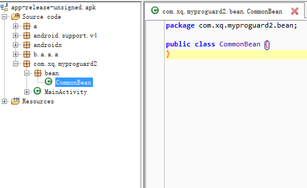

本类名不被混淆，内容被混淆

```
-keep class com.xq.myproguard2.bean.CommonBean{*;}
```
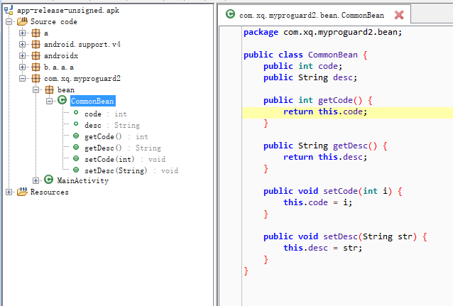

本类名和内容都不被混淆

```
-keep class com.xq.myproguard2.bean.*
```
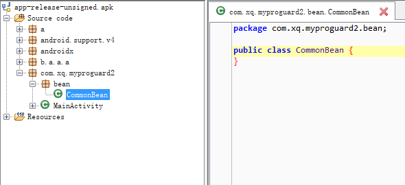

一颗星表示只是保持该包下的类名，而子包下的类名还是会被混淆,内容也会被混淆；

本包下的所有类名不被混淆，内容被混淆

本包下的所有子包被混淆

```
-keep class com.xq.myproguard2.bean.**
```
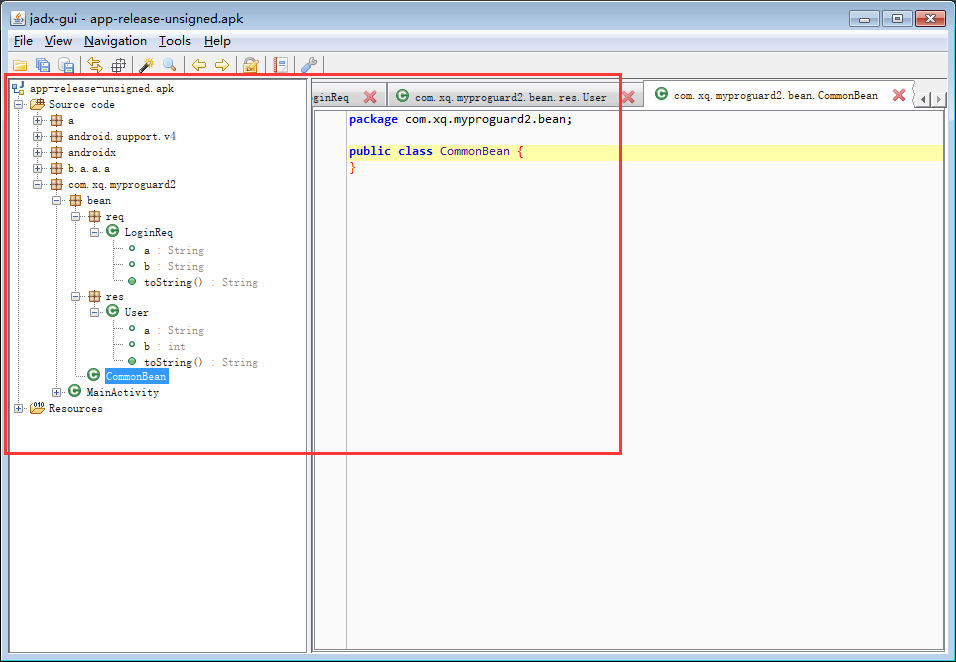
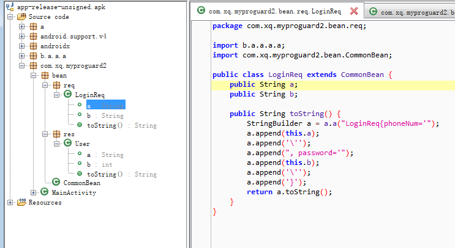
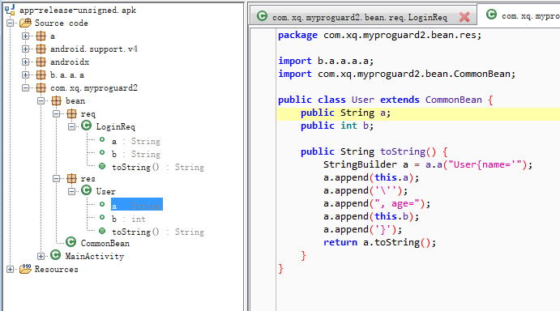

两颗星表示把本包和所含子包下的类名都保持,内容也会被混淆；

本包下的所有【类名】不被混淆，内容混淆

本包下的所有子包下的【类名】不被混淆，内容混淆

```
-keep class com.xq.myproguard2.bean.** { *; }
```
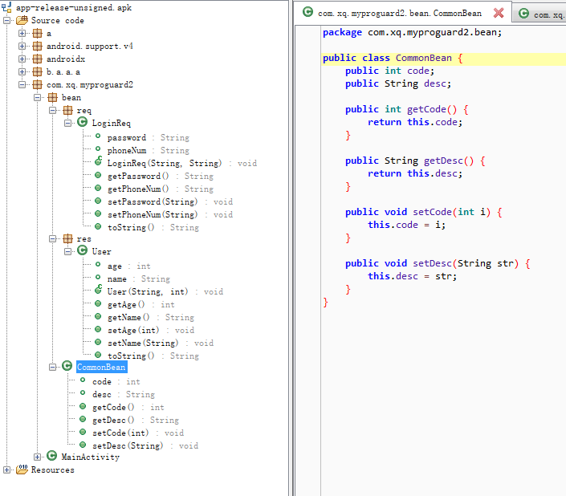
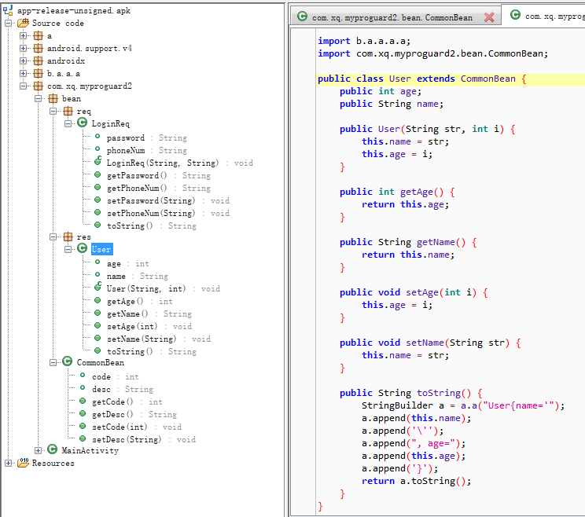
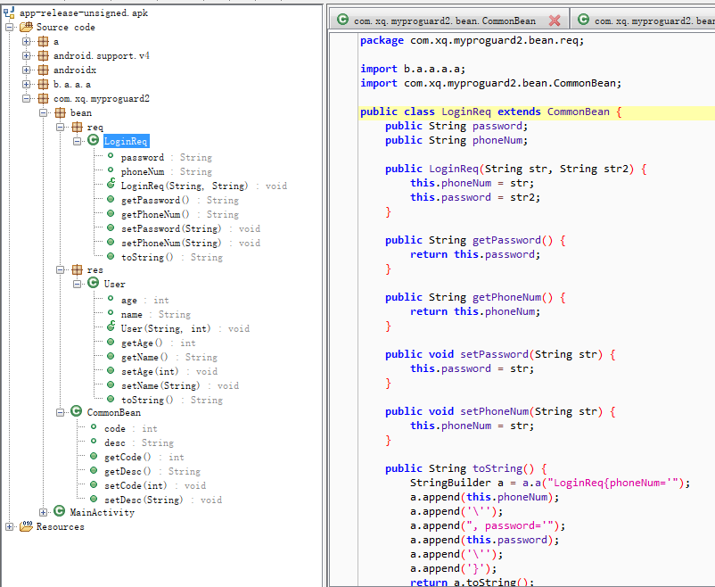

** { *; } ：

本包和所含子包下的类名都保持，内容也不被混淆：

本包下的所有【类名】不被混淆，内容也不混淆

本包下的所有子包下的【类名】不被混淆，内容也不混淆


```
-keep class * extends com.xq.myproguard2.bean.** { *; }
```
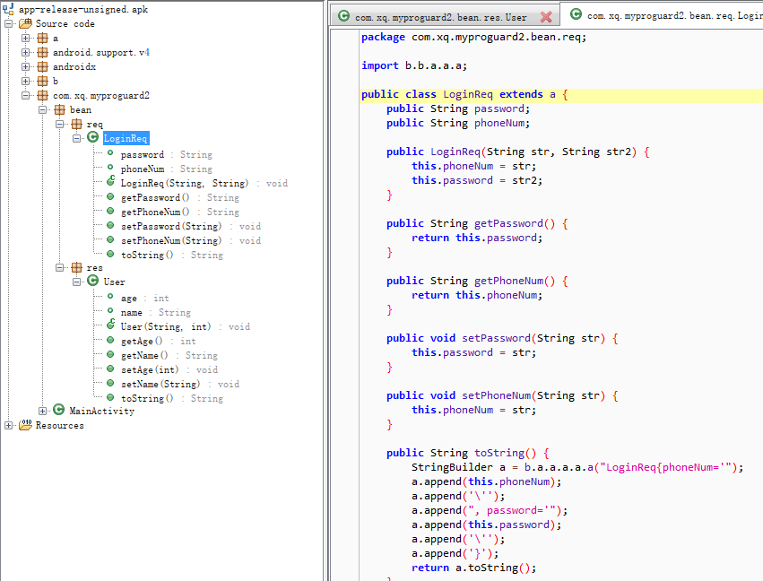
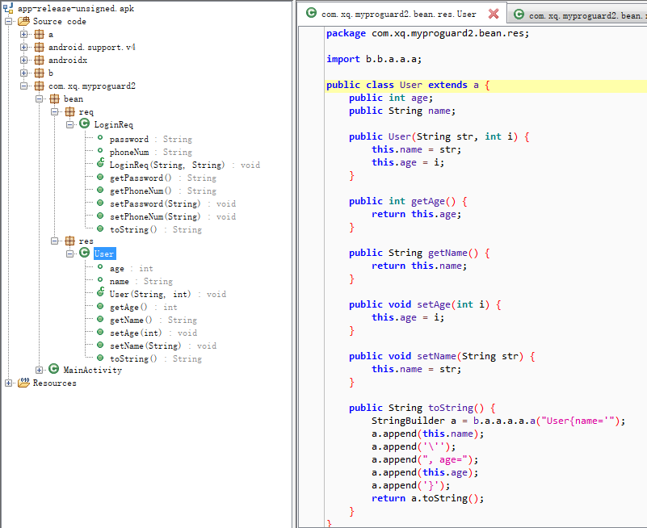

【本包和所含子包下的类名LoginReq、User、CommonBean】的子类LoginReq、User都保持，内容也不被混淆，基类CommonBean被混淆


